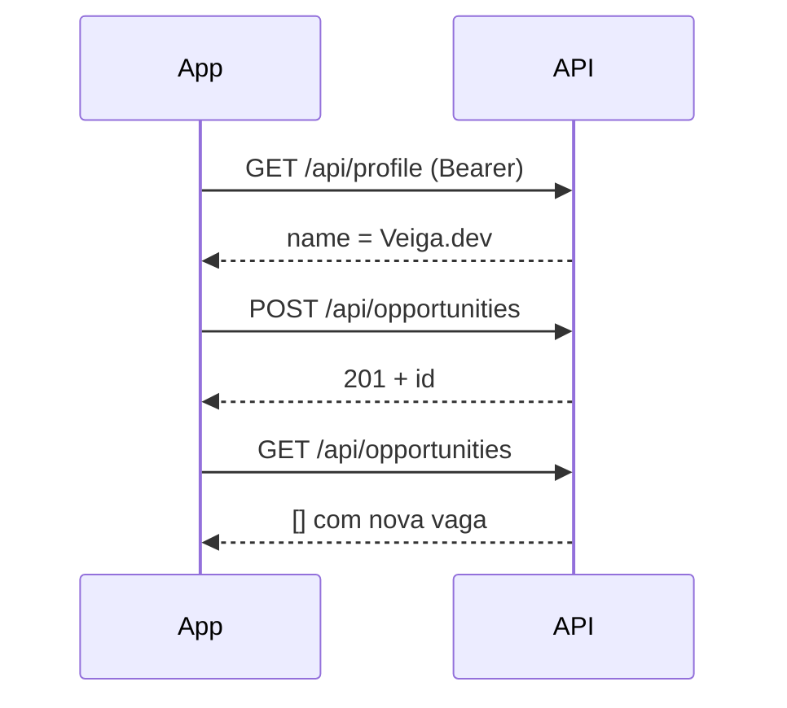

# Contrato — Vagas / Oportunidades (`/api/opportunities`)

Referência alinhada ao **backend Go** (`internal/modulos/empresa`) e ao app Flutter. Convenções gerais: [CONTRATO_API.md](./CONTRATO_API.md). Cadastro empresa: [contrato_register_grupos.md](./contrato_register_grupos.md).

---

## Estado da implementação (Go)

| Rota | Implementado | Auth |
|------|--------------|------|
| `GET /api/opportunities` | Sim | Não (público) |
| `GET /api/opportunities/:id` | Sim | Não |
| `POST /api/opportunities` | Sim | `empresa` \| `sistema_admin` |
| `PUT /api/opportunities/:id` | Sim | Dono da vaga ou `sistema_admin` |
| `DELETE /api/opportunities/:id` | Sim | Dono ou `sistema_admin` |
| `GET /api/opportunities/:id/applicants` | Stub (dados mock) | `empresa` \| `sistema_admin` |
| `GET /api/opportunities/types` | **Não** | — |
| `POST /api/opportunities/:id/apply` | **Não** | — |

Código: `internal/modulos/empresa/handler/empresa_handler_http.go`, `repository/empresa_repository.go`.

---

## Convenções

| Item | Valor |
|------|--------|
| Base | `http://localhost:8080` / `API_BASE_URL` |
| JSON | `snake_case` |
| Erros | `{ "code", "message", "api_revision" }` — ver [CONTRATO_API.md](./CONTRATO_API.md) |
| Listas | **`GET /opportunities` devolve array na raiz** `[]` (não envelope `items`) |

### Headers (pedidos JSON)

- `Content-Type: application/json`
- `Accept: application/json` (ou vazio / `*/*`)

---

## Permissões

| `role` (JWT) | `POST` criar | `PUT`/`DELETE` | `GET …/applicants` |
|--------------|--------------|----------------|---------------------|
| `empresa` | Sim | Só vagas com `author_id` = seu `user_id` | Sim |
| `sistema_admin` | Sim | Qualquer vaga | Sim |
| Outros | 403 `forbidden` | 403 | 403 |

Middleware: `auth.ExigirPerfis("empresa", "sistema_admin")` nas rotas de escrita e candidatos.

---

## `company_name` (front vs back)

| Front | Back hoje |
|-------|-----------|
| Lê `GET /api/profile` → `name` e envia em `company_name` | Aceita o valor do body **sem** validar contra o perfil |
| Sugestão: back ignorar body ou validar | **Não implementado** — spoofing teórico possível |

---

## `GET /api/opportunities`

**Auth:** não.

**Resposta 200:** array JSON de vagas (pode ser `[]`).

**Campos por item** (modelo `Oportunidade`):

| Campo | Tipo | Front parseia | Notas |
|-------|------|---------------|--------|
| `id` | string | sim | |
| `title` | string | sim | |
| `company_name` | string | sim | |
| `short_description` | string | sim | |
| `full_description` | string | sim | |
| `apply_deadline` | string ISO | sim | Resposta em **RFC3339 UTC** (ex. `2026-08-31T23:59:59Z`) |
| `work_location` | string | sim | `remote` \| `hybrid` \| `on_site` |
| `type_label` | string | sim | Livre (sem catálogo no back) |
| `requirements` | string[] | sim | Ausente na BD → `[]` |
| `author_id` | string | opcional | Extra no back |
| `author` | objeto | opcional | `{ id, name, avatar_url, role }` |

---

## `GET /api/opportunities/:id`

**Auth:** não.

**200:** objeto vaga (mesmo schema acima).  
**404:** `{ "code": "not_found", "message": "resource not found" }`.

---

## `POST /api/opportunities`

**Auth:** `Authorization: Bearer <access_token>`.

### Corpo

| Campo | Tipo | Obrigatório | Validação no back |
|-------|------|-------------|-------------------|
| `title` | string | sim | não vazio |
| `company_name` | string | sim | não vazio |
| `short_description` | string | sim | não vazio, máx. 500 chars |
| `full_description` | string | sim | não vazio |
| `apply_deadline` | string ISO | sim | RFC3339, `…T…` sem fuso, ou `YYYY-MM-DD` |
| `work_location` | string | sim | `remote` \| `hybrid` \| `on_site` |
| `type_label` | string | sim | não vazio |
| `requirements` | string[] | sim | máx. 20 itens, cada um máx. 50 chars; `[]` válido |
| `publish_scope` | string | não | Cria cartão no feed (`all` default) |
| `publish_group_id` | string | não | Se `publish_scope` = grupo |

### `apply_deadline` (entrada)

O Flutter costuma enviar `DateTime.toIso8601String()` **sem** `Z`, ex.:

`2026-08-31T23:59:59.000`

O back **aceita** isso (além de RFC3339 com `Z` e só data).

### Exemplo

```json
{
  "title": "Desenvolvedor Flutter — Estágio",
  "company_name": "Veiga.dev",
  "short_description": "Estágio em app mobile para campus.",
  "full_description": "Atividades: UI, integração REST, testes...",
  "apply_deadline": "2026-08-31T23:59:59.000",
  "work_location": "hybrid",
  "type_label": "Estágio",
  "requirements": ["Flutter", "Git", "Inglês intermediário"]
}
```

### Resposta

- **201 Created** — objeto vaga com `id` (inclui `author_id` / `author` se carregados).
- Side effect: insert em `oportunidades` + cartão no feed (`kind`: `internship`).

### Erros

| HTTP | `code` | Quando |
|------|--------|--------|
| 400 | `invalid_json` | Body inválido |
| 400 | `invalid_opportunity` | Validação (`message` começa por `oportunidade invalida: …`) |
| 401 | `unauthorized` | Sem token / sessão |
| 403 | `forbidden` | Role não permitida |
| 500 | `server_error` | BD / erro interno |

---

## `PUT /api/opportunities/:id`

Mesmo corpo do `POST`. **200** com objeto vaga.

Erros: `invalid_opportunity`, `not_found`, `forbidden`, `server_error`.

---

## `DELETE /api/opportunities/:id`

**200:** `{ "status": "deleted" }`.

Remove vaga e cartão de feed associado (`kind` = `internship`).

---

## `GET /api/opportunities/:id/applicants`

**Auth:** empresa / admin.

**200 hoje:** array **mock** (2 candidatos de exemplo) — **não** lê BD.

Schema do item mock:

| Campo | Tipo |
|-------|------|
| `user_id` | string |
| `name` | string |
| `email` | string |
| `profile_summary` | string |
| `resume_url` | string |
| `application_status` | string (`submitted`, `in_review`, …) |

Contrato final de candidatura: **a definir** quando existir tabela de candidaturas.

---

## `work_location`

| Valor API | UI (pt) |
|-----------|---------|
| `remote` | Remoto |
| `hybrid` | Híbrido |
| `on_site` | Presencial |

Enum PostgreSQL / Go: `internal/modulos/empresa/structs/empresa_enum.go`.

---

## `type_label`

- **Front:** catálogo fixo em `tipos_vaga.dart` (Estágio, CLT, PJ, …).
- **Back:** string livre; **não** valida contra lista.
- **`GET /api/opportunities/types`:** não existe — opcional para o front deixar de hardcodar.

---

## Diferenças front ↔ back (checklist)

| Tópico | Front espera | Back actual |
|--------|--------------|-------------|
| Lista | Array ou envelope `items`/`data` | Só **array na raiz** |
| Erro validação | `invalid_opportunity` | Sim (após validação em `empresa_validacao.go`) |
| `company_name` vs token | Validar / ignorar body | Não valida |
| Candidatos | Lista real | Mock |
| Candidatar-se | `POST …/apply` | Não existe |

---

## Fluxo empresa (resumo)



---

## Ficheiros Go

| Caminho | Papel |
|---------|--------|
| `internal/modulos/empresa/handler/empresa_handler_http.go` | Rotas HTTP |
| `internal/modulos/empresa/service/empresa_service.go` | Orquestração |
| `internal/modulos/empresa/service/empresa_validacao.go` | Validação + parse de deadline |
| `internal/modulos/empresa/repository/empresa_repository.go` | PostgreSQL `oportunidades` + feed |
| `internal/modulos/empresa/structs/empresa_dto.go` | Request |
| `internal/modulos/empresa/structs/empresa_model.go` | Response |
